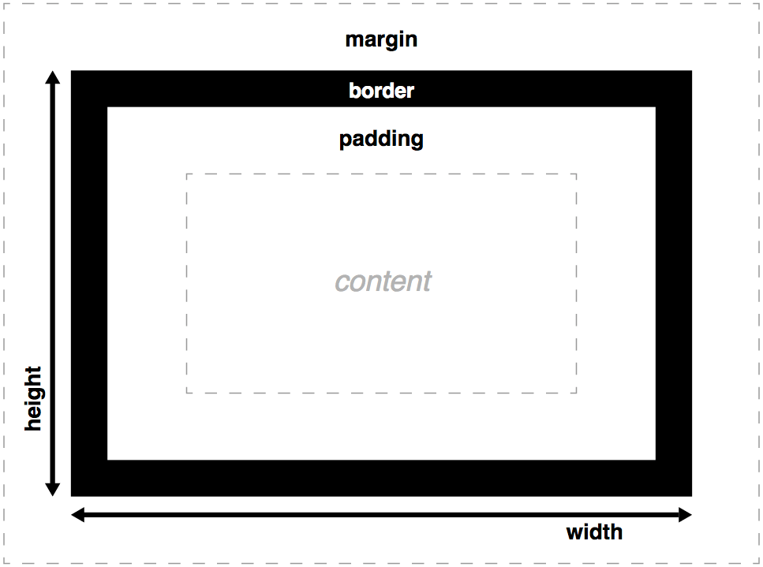
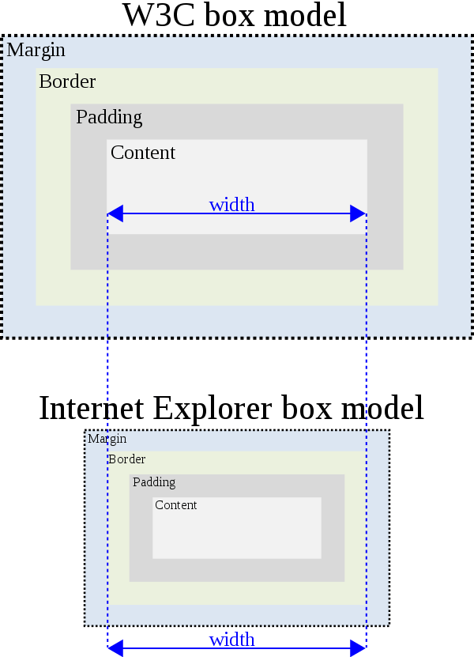

## [html] 常见的浏览器内核都有哪些？并介绍下你对内核的理解

• IE: trident内核 

• Firefox：gecko内核 

• Safari:webkit内核

• Opera:以前是presto内核，Opera现已改用Google Chrome的Blink内核

• Chrome:Blink(基于webkit，Google与Opera Software共同开发)

## [css] 说说你对css盒子模型的理解

CSS 盒模型是网页布局的基础，每个元素都被表示成矩形的方框，每个方框都包含内容、内边距、边框和外边距四个部分，在浏览器进行渲染时会计算出各个部分的样式。

1. 标准的盒模型在设置 width 和 height 时，控制的是内容框的宽和高：


这样在某些情况下进行页面布局会不方便。比如，想让一个元素的宽度是父元素的一半。

2. 这时，将 box-sizing 设置为 border-box 的话，width 和 height 的值就分别是内容框的宽、高加上内边距和边框的大小：


这个就是 IE 曾经使用的盒模型

3. 


外边距有个特别的行为：当两个有外边距的元素相互接触时，之间的间距将取相邻两个外边距的最大值，而不是它们的总和。这个行为叫做「外边距塌陷」。


## [js] 写一个获取当前url查询字符串中的参数的方法
```javascript
//方法1：
function getUrlParam(str) {
  var temp = str.split('?')[1]  //a=1&b=2&c=3#target
  if(temp.indexOf('#')){
    temp = temp.split('#')[0] //a=1&b=2&c=3
  }
  var final = temp.split('&').reduce((total,curValue,cueIndex,arr)=>{
    var key = curValue.split('=')[0];
    var value = curValue.split('=')[1];
    total[key] = value;
    return total;
  },{})
  return final;
}

var a = "https://github.com/kk?tab=stars&assetId=311&page=DETAIL&projectPhase=2";
var result = getUrlParam(a)
console.log(result)


//方法2：TODO:重点去学一下正则
function urlParam(str){
  const param = {};
  str.replace(/([^&=?]+)=([^&]+)/g,(m,$1,$2)=> param[$1] = $2);
  return param;
}
var b = "https://github.com/kk?tab=stars&assetId=311&page=DETAIL&projectPhase=2";
var result1 = urlParam(b)
console.log(result1)
```

## [软技能] 网页应用从服务器主动推送到客户端有那些方式？

1. html5 websocket
2. WebSocket 通过 Flash
3. XHR长时间连接
4. XHR Multipart Streaming
5. 不可见的Iframe，会一直转圈圈
6. <script>标签的长时间连接(可跨域)

comet,AJAX 长轮询

[Comet：基于 HTTP 长连接的“服务器推”技术](https://www.ibm.com/developerworks/cn/web/wa-lo-comet/)
